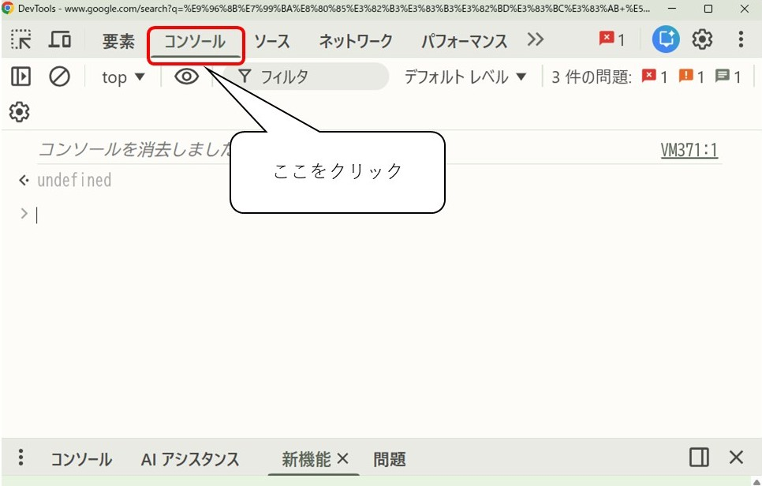

# コンソール

## 🖥️ Webブラウザのコンソールとは？

**コンソール**とは、Webブラウザに<ruby>内蔵<rt>ないぞう</rt></ruby>されている<ruby>開発者<rt>かいはつしゃ</rt></ruby><ruby>向<rt>む</rt></ruby>けのツールの<ruby>一部<rt>いちぶ</rt></ruby>で、JavaScriptの<ruby>動作確認<rt>どうさかくにん</rt></ruby>やエラーのチェックができる<ruby>場所<rt>ばしょ</rt></ruby>です。

* JavaScriptのコードを<ruby>直接<rt>ちょくせつ</rt></ruby><ruby>入力<rt>にゅうりょく</rt></ruby>して<ruby>試<rt>ため</rt></ruby>すことができます。
* `console.log()` などを<ruby>使<rt>つか</rt></ruby>って、プログラムの<ruby>途中経過<rt>とちゅうけいか</rt></ruby>や<ruby>値<rt>あたい</rt></ruby>を<ruby>表示<rt>ひょうじ</rt></ruby>できます。
* エラーが<ruby>発生<rt>はっせい</rt></ruby>したときには、**エラーメッセージ**が<ruby>表示<rt>ひょうじ</rt></ruby>されるので、<ruby>原因<rt>げんいん</rt></ruby>を<ruby>調<rt>しら</rt></ruby>べるのに<ruby>役立<rt>やくだ</rt></ruby>ちます。

***

## 🧭 コンソールを<ruby>表示<rt>ひょうじ</rt></ruby>させる<ruby>方法<rt>ほうほう</rt></ruby>（Edge・Chrome）

<ruby>以下<rt>いか</rt></ruby>の<ruby>方法<rt>ほうほう</rt></ruby>で、コンソールを<ruby>表示<rt>ひょうじ</rt></ruby>できます：

* **Windowsの<ruby>場合<rt>ばあい</rt></ruby>**：  
  → キーボードの **`F12`キー** を<ruby>押<rt>お</rt></ruby>す  
  → または、<ruby>右<rt>みぎ</rt></ruby>クリック → 「<ruby>検証<rt>けんしょう</rt></ruby>」 → <ruby>上部<rt>じょうぶ</rt></ruby>の「Console」タブを<ruby>選択<rt>せんたく</rt></ruby>

* **Macの<ruby>場合<rt>ばあい</rt></ruby>**：  
  → `Command + Option + I` を<ruby>押<rt>お</rt></ruby>す

📌 <ruby>表示<rt>ひょうじ</rt></ruby>された<ruby>画面<rt>がめん</rt></ruby>の「Console」または「コンソール」タブが、JavaScriptのコンソールです。

<ruby>下<rt>した</rt></ruby>はChromeの例です。

***
