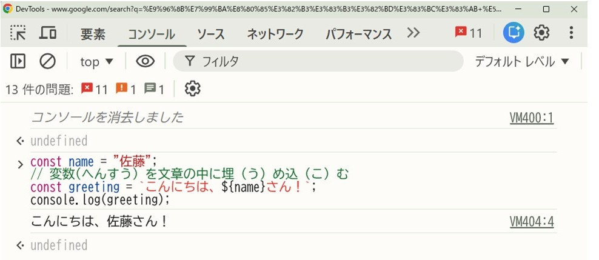
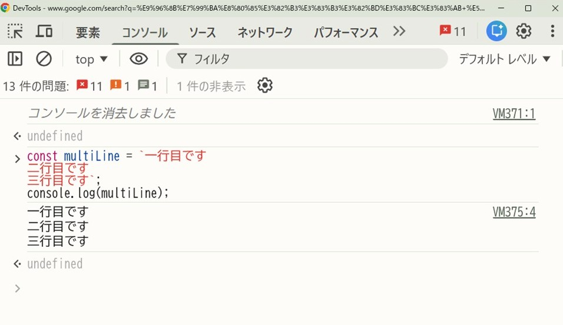

# テンプレートリテラル

<ruby>最新<rt>さいしん</rt></ruby>のスマートな<ruby>書<rt>か</rt></ruby>き<ruby>方<rt>かた</rt></ruby>

バッククォート（ \` ）と ${ } を<ruby>使<rt>つか</rt></ruby>った「テンプレートリテラル」を<ruby>使<rt>つか</rt></ruby>うと、<ruby>変数<rt>へんすう</rt></ruby>の<ruby>埋<rt>う</rt></ruby>め<ruby>込<rt>こ</rt></ruby>みや<ruby>改行<rt>かいぎょう</rt></ruby>が<ruby>非常<rt>ひじょう</rt></ruby>に<ruby>簡単<rt>かんたん</rt></ruby>になります。

```javascript
const name = "佐藤";
// 変数(へんすう）を文章の中に埋（う）め込（こ）む
const greeting = `こんにちは、${name}さん！`; // ここがテンプレートリテラル
console.log(greeting);

```




テンプレートリテラルなら、そのまま改行（かいぎょう）もできます。

```javascript
const multiLine = `一行目です
二行目です
三行目です`;
console.log(multiLine);

```



