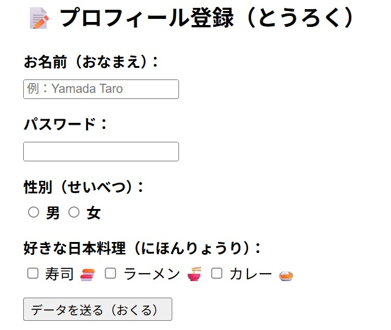

# <ruby>HTML<rt>エイチティーエムエル</rt></ruby>

**<ruby>留学生<rt>りゅうがくせい</rt></ruby>のためのHTML<ruby>基礎<rt>きそ</rt></ruby>ガイド：JavaScriptを<ruby>学<rt>まな</rt></ruby>ぶ<ruby>前<rt>まえ</rt></ruby>に**

Web<ruby>開発<rt>かいはつ</rt></ruby>を<ruby>勉強<rt>べんきょう</rt></ruby>するみなさん、こんにちは。このガイドでは、プログラミングのJavaScriptを<ruby>勉強<rt>べんきょう</rt></ruby>する<ruby>前<rt>まえ</rt></ruby>に、とても<ruby>大切<rt>たいせつ</rt></ruby>な「HTML」と「CSS」をわかりやすく<ruby>説明<rt>せつめい</rt></ruby>します。

## I. はじめに：ウェブページを<ruby>構成<rt>こうせい</rt></ruby>する「3つの<ruby>力<rt>ちから</rt></ruby>」

Webサイトを<ruby>作<rt>つく</rt></ruby>るときには、3つの<ruby>技術<rt>ぎじゅつ</rt></ruby>を<ruby>使<rt>つか</rt></ruby>います。それはHTML、CSS、そしてJavaScriptです。これらを「<ruby>家<rt>いえ</rt></ruby>」に<ruby>例<rt>たと</rt></ruby>えて<ruby>考<rt>かんが</rt></ruby>えてみましょう。

* HTML： <ruby>家<rt>いえ</rt></ruby>の「<ruby>柱<rt>はしら</rt></ruby>」や「<ruby>壁<rt>かべ</rt></ruby>」です。<ruby>建物<rt>たてもの</rt></ruby>の<ruby>骨組<rt>ほねぐ</rt></ruby>みを<ruby>作<rt>つく</rt></ruby>る<ruby>役割<rt>やくわり</rt></ruby>があります。
* CSS： <ruby>家<rt>いえ</rt></ruby>の「ペンキ」や「インテリア」です。<ruby>色<rt>いろ</rt></ruby>を<ruby>塗<rt>ぬ</rt></ruby>ったりして、<ruby>見<rt>み</rt></ruby>た<ruby>目<rt>め</rt></ruby>をきれいに<ruby>整<rt>ととの</rt></ruby>えます。
* JavaScript： <ruby>家<rt>いえ</rt></ruby>の「<ruby>電気<rt>でんき</rt></ruby>」や「<ruby>機械<rt>きかい</rt></ruby><ruby>装置<rt>そうち</rt></ruby>」です。ボタンを<ruby>押<rt>お</rt></ruby>すとライトがつくような、<ruby>動<rt>うご</rt></ruby>きや<ruby>機能<rt>きのう</rt></ruby>を<ruby>作<rt>つく</rt></ruby>ります。

HTMLはウェブページの<ruby>土台<rt>どだい</rt></ruby>です。HTMLの<ruby>骨組<rt>ほねぐ</rt></ruby>みが<ruby>正<rt>ただ</rt></ruby>しくないと、あとからJavaScriptを<ruby>使<rt>つか</rt></ruby>っても、うまく<ruby>動<rt>うご</rt></ruby>きません。まずは、ページの<ruby>見<rt>み</rt></ruby>えない<ruby>部分<rt>ぶぶん</rt></ruby>である「<ruby>設定<rt>せってい</rt></ruby>」から<ruby>理解<rt>りかい</rt></ruby>しましょう。

## II. HTMLのメタ<ruby>情報<rt>じょうほう</rt></ruby>：ウェブページの「<ruby>設定<rt>せってい</rt></ruby>」を<ruby>理解<rt>りかい</rt></ruby>する

ウェブページには、ユーザーには<ruby>見<rt>み</rt></ruby>えませんが、ブラウザや<ruby>検索<rt>けんさく</rt></ruby>エンジンにとって<ruby>大切<rt>たいせつ</rt></ruby>な<ruby>情報<rt>じょうほう</rt></ruby>があります。これを「メタ<ruby>情報<rt>じょうほう</rt></ruby>」と<ruby>呼<rt>よ</rt></ruby>び、`<head>`タグの<ruby>中<rt>なか</rt></ruby>に<ruby>書<rt>か</rt></ruby>きます。

* `<title>`タグ： ブラウザのタブに<ruby>表示<rt>ひょうじ</rt></ruby>される<ruby>名前<rt>なまえ</rt></ruby>です。そのページの<ruby>内容<rt>ないよう</rt></ruby>を<ruby>伝<rt>つた</rt></ruby>えます。
* <ruby>文字<rt>もじ</rt></ruby>コードの<ruby>設定<rt>せってい</rt></ruby>： <ruby>日本語<rt>にほんご</rt></ruby>などが<ruby>正<rt>ただ</rt></ruby>しく<ruby>表示<rt>ひょうじ</rt></ruby>されるようにするための<ruby>設定<rt>せってい</rt></ruby>です。

もし、<ruby>文字<rt>もじ</rt></ruby>コードの<ruby>設定<rt>せってい</rt></ruby>が<ruby>正<rt>ただ</rt></ruby>しくないと、<ruby>文字<rt>もじ</rt></ruby>が「<ruby>読<rt>よ</rt></ruby>めない<ruby>記号<rt>きごう</rt></ruby>」になってしまいます。これを「<ruby>文字化<rt>もじば</rt></ruby>け」と<ruby>言<rt>い</rt></ruby>います。<ruby>設定<rt>せってい</rt></ruby>が<ruby>終<rt>お</rt></ruby>わったら、<ruby>次<rt>つぎ</rt></ruby>は<ruby>実際<rt>じっさい</rt></ruby>に<ruby>画面<rt>がめん</rt></ruby>で<ruby>見<rt>み</rt></ruby>えるコンテンツを<ruby>作<rt>つく</rt></ruby>りましょう。

## III. いろいろなHTMLタグ：<ruby>情報<rt>じょうほう</rt></ruby>の<ruby>意味<rt>いみ</rt></ruby>を<ruby>決<rt>き</rt></ruby>める

ウェブページをつくるための「HTMLタグ」と「<ruby>特殊<rt>とくしゅ</rt></ruby><ruby>記号<rt>きごう</rt></ruby>」について、やさしい<ruby>日本語<rt>にほんご</rt></ruby>で<ruby>説明<rt>せつめい</rt></ruby>します。

### HTMLタグとは？

HTMLは、ウェブページの **「<ruby>骨組<rt>ほねぐ</rt></ruby>み」** をつくるための<ruby>言葉<rt>ことば</rt></ruby>です。  
タグは、`<` と `>` で<ruby>名前<rt>なまえ</rt></ruby>を<ruby>囲<rt>かこ</rt></ruby>んで<ruby>書<rt>か</rt></ruby>きます。たいていの<ruby>場合<rt>ばあい</rt></ruby>、<ruby>始<rt>はじ</rt></ruby>まりのタグ（<ruby>例<rt>れい</rt></ruby>：`<p>`）と<ruby>終<rt>お</rt></ruby>わりのタグ（<ruby>例<rt>れい</rt></ruby>：`</p>`）で<ruby>文字<rt>もじ</rt></ruby>をはさみます。タグはタグで<ruby>囲<rt>かこ</rt></ruby>まれた<ruby>部分<rt>ぶぶん</rt></ruby>が、HTMLの<ruby>中<rt>なか</rt></ruby>でどのような<ruby>仕事<rt>しごと</rt></ruby>をしているかを<ruby>示<rt>しめ</rt></ruby>します。

#### 1. <ruby>見出<rt>みだ</rt></ruby>し（Heading）: `<h1>` 〜 `<h6>`

ページのタイトルや、<ruby>中身<rt>なかみ</rt></ruby>の「<ruby>見出<rt>みだ</rt></ruby>し」に<ruby>使<rt>つか</rt></ruby>います。

* `<h1>` が<ruby>一番<rt>いちばん</rt></ruby><ruby>大<rt>おお</rt></ruby>きく、`<h6>` が<ruby>一番<rt>いちばん</rt></ruby><ruby>小<rt>ちい</rt></ruby>さいです。
* <ruby>文字<rt>もじ</rt></ruby>を<ruby>大<rt>おお</rt></ruby>きくするためではなく、ページの<ruby>内容<rt>ないよう</rt></ruby>（<ruby>構造<rt>こうぞう</rt></ruby>）をわかりやすくするために<ruby>使<rt>つか</rt></ruby>います。

| タグ                                | <ruby>表示<rt>ひょうじ</rt></ruby> |
| --------------------------------- | ---------------------------- |
| `<h1>1番大きな見出し</h1>`   | \<h1>1番大きな見出し\</h1>          |
| `<h2>2番目に大きな見出し</h2>` | \<h2>2番目に大きな見出し\</h2>        |
| `<h3>3番目に大きな見出し</h3>` | \<h3>3番目に大きな見出し\</h3>        |
| `<h4>4番目に大きな見出し</h4>` | \<h4>4番目に大きな見出し\</h4>        |
| `<h5>5番目に大きな見出し</h5>` | \<h5>5番目に大きな見出し\</h5>        |
| `<h6>6番目に大きな見出し</h6>` | \<h6>6番目に大きな見出し\</h6>        |

#### 2. リンク（Link）: `<a>`

<ruby>他<rt>ほか</rt></ruby>のページへ<ruby>行<rt>い</rt></ruby>くためのボタンや<ruby>文字<rt>もじ</rt></ruby>をつくります。

* `href` という「<ruby>属性<rt>ぞくせい</rt></ruby>お<ruby>話<rt>はなし</rt></ruby>」を<ruby>使<rt>つか</rt></ruby>って、<ruby>行<rt>い</rt></ruby>きたい<ruby>場所<rt>ばしょ</rt></ruby>の<ruby>住所<rt>じゅうしょ</rt></ruby>（URL）を<ruby>書<rt>か</rt></ruby>きます。
* （<ruby>例<rt>れい</rt></ruby>） `<a href="https://www.mozilla.org/">Mozilla</a>`

この\<a href="<https://www.saitama-cmcc.ac.jp/>"><ruby>埼玉<rt>さいたま</rt></ruby>コンピュータ<ruby>医療<rt>いりょう</rt></ruby><ruby>事務<rt>じむ</rt></ruby><ruby>専門<rt>せんもん</rt></ruby><ruby>学校<rt>がっこう</rt></ruby>\</a>という<ruby>文字<rt>もじ</rt></ruby>をクリックすると、<ruby>学校<rt>がっこう</rt></ruby>のホームページが<ruby>表示<rt>ひょうじ</rt></ruby>されます。

#### 3. <ruby>強調<rt>きょうちょう</rt></ruby>（Emphasis）: `<strong>`

<ruby>大事<rt>だいじ</rt></ruby>な<ruby>言葉<rt>ことば</rt></ruby>を<ruby>強調<rt>きょうちょう</rt></ruby>（<ruby>強<rt>つよ</rt></ruby>く<ruby>見<rt>み</rt></ruby>せる）するときに<ruby>使<rt>つか</rt></ruby>います。ブラウザでは、**<ruby>太<rt>ふと</rt></ruby>い<ruby>文字<rt>もじ</rt></ruby>** のように<ruby>表示<rt>ひょうじ</rt></ruby>されます。

#### 4. <ruby>水平線<rt>すいへいせん</rt></ruby>（Horizontal rule）: `<hr>`

<ruby>話題<rt>わだい</rt></ruby>が<ruby>変<rt>か</rt></ruby>わるときなどに、<ruby>横<rt>よこ</rt></ruby>に<ruby>長<rt>なが</rt></ruby>い<ruby>線<rt>せん</rt></ruby>を<ruby>引<rt>ひ</rt></ruby>きます。

***

<ruby>上<rt>うえ</rt></ruby>の<ruby>線<rt>せん</rt></ruby>が<ruby>水平線<rt>すいへいせん</rt></ruby>です。

#### 5. <ruby>段落<rt>だんらく</rt></ruby>（Paragraph）: `<p>`

ふつうの<ruby>文章<rt>ぶんしょう</rt></ruby>のまとまり（<ruby>段落<rt>だんらく</rt></ruby>）をつくるときに<ruby>使<rt>つか</rt></ruby>います。<ruby>文章<rt>ぶんしょう</rt></ruby>を<ruby>書<rt>か</rt></ruby>くときに<ruby>一番<rt>いちばん</rt></ruby>よく<ruby>使<rt>つか</rt></ruby>います。


```html
<p>ながい ぶんしょうを ずっと よみ つづけるのは たいへん ですよね。そこで 「おなじ ないようの おはなしを ひとつに まとめて くぎりを つけた ものが 「段落（だんらく）」です。</p>

<p>だんらく より おおきな グループに、「節（せつ）」や「章（しょう）」が あります。<p>
```

これは<ruby>下<rt>した</rt></ruby>のように<ruby>表示<rt>ひょうじ</rt></ruby>されます。

***

<p>ながい ぶんしょうを ずっと よみ つづけるのは たいへん ですよね。そこで 「おなじ ないようの おはなしを ひとつに まとめて くぎりを つけた ものが 「段落（だんらく）」です。</p>

<p>だんらく より おおきな グループに、「節（せつ）」や「章（しょう）」が あります。<p>

***

#### 6. <ruby>改行<rt>かいぎょう</rt></ruby>（Line break）: `<br>`

<ruby>新<rt>あたら</rt></ruby>しい<ruby>段落<rt>だんらく</rt></ruby>をつくらずに、<ruby>次<rt>つぎ</rt></ruby>の<ruby>行<rt>ぎょう</rt></ruby>へ<ruby>行<rt>い</rt></ruby>きたいときに<ruby>使<rt>つか</rt></ruby>います。これには<ruby>終<rt>お</rt></ruby>わりのタグ（`</br>`）はありません。

```html
<p>ながい ぶんしょうを ずっと よみ つづけるのは たいへん ですよね。そこで 「おなじ ないようの おはなしを ひとつに まとめて くぎりを つけた ものが 「段落（だんらく）」です。</br>
だんらく より おおきな グループに、「節（せつ）」や「章（しょう）」が あります。<p>
```

これは<ruby>下<rt>した</rt></ruby>のように<ruby>表示<rt>ひょうじ</rt></ruby>されます。

***

<p>ながい ぶんしょうを ずっと よみ つづけるのは たいへん ですよね。そこで 「おなじ ないようの おはなしを ひとつに まとめて くぎりを つけた ものが 「段落（だんらく）」です。</br>
だんらく より おおきな グループに、「節（せつ）」や「章（しょう）」が あります。<p>

***

#### 7. イメージ（Image）: ``

ページに<ruby>写真<rt>しゃしん</rt></ruby>やイラストを<ruby>表示<rt>ひょうじ</rt></ruby>します。

* `src`: <ruby>画像<rt>がぞう</rt></ruby>がある<ruby>場所<rt>ばしょ</rt></ruby>（パス）を<ruby>書<rt>か</rt></ruby>きます。
* `alt`: <ruby>目<rt>め</rt></ruby>が<ruby>見<rt>み</rt></ruby>えない<ruby>人<rt>ひと</rt></ruby>や<ruby>画像<rt>がぞう</rt></ruby>が<ruby>出<rt>で</rt></ruby>なかったときのために、<ruby>画像<rt>がぞう</rt></ruby>の<ruby>説明<rt>せつめい</rt></ruby>を<ruby>書<rt>か</rt></ruby>きます。


\

#### 8. <ruby>整形済<rt>せいけいず</rt></ruby>みテキスト: `<pre>`

プログラムのコードなどを、<ruby>書<rt>か</rt></ruby>いた<ruby>通<rt>とお</rt></ruby>りの<ruby>形<rt>かたち</rt></ruby>で<ruby>表示<rt>ひょうじ</rt></ruby>します。

* スペースや<ruby>改行<rt>かいぎょう</rt></ruby>がそのまま<ruby>画面<rt>がめん</rt></ruby>に<ruby>出<rt>で</rt></ruby>ます。

`<h1>1番大きな見出し</h>`のように、<ruby>書<rt>か</rt></ruby>いたまま、<ruby>表示<rt>ひょうじ</rt></ruby>されます。

#### 9. リスト（List）: `<ul>`, `<ol>`, `<li>`

<ruby>箇条書<rt>かじょうが</rt></ruby>き（かじょうがき）をつくります。

* `<ul>`: <ruby>点<rt>てん</rt></ruby>（・）がつくリストです。
* `<ol>`: 1, 2, 3... と<ruby>数字<rt>すうじ</rt></ruby>がつくリストです。
* `<li>`: リストの<ruby>中<rt>なか</rt></ruby>の、ひとつひとつのアイテムに<ruby>使<rt>つか</rt></ruby>います。

**コードの例：**

`ul`の例

```html
<ul>
  <li>赤（あか）</li>
  <li>緑（みどり）</li>
  <li>青（あお）</li>
</ul>
```

`ol`の例

```html
<ol>
  <li>赤（あか）</li>
  <li>緑（みどり）</li>
  <li>青（あお）</li>
</ol>
```

このHTMLは下のように表示されます。

`ul`の例

<ul>
  <li>赤（あか）</li>
  <li>緑（みどり）</li>
  <li>青（あお）</li>
</ul>

`ol`の例

<ol>
  <li>赤（あか）</li>
  <li>緑（みどり）</li>
  <li>青（あお）</li>
</ol>

***


### <ruby>特殊記号<rt>とくしゅきごう</rt></ruby>（とくしゅきごう）

HTMLでは、`<` や `>` は「タグ」として<ruby>使<rt>つか</rt></ruby>われます。そのため、これらを「<ruby>文字<rt>もじ</rt></ruby>」として<ruby>画面<rt>がめん</rt></ruby>に<ruby>出<rt>だ</rt></ruby>したいときは、<ruby>特別<rt>とくべつ</rt></ruby>な<ruby>書<rt>か</rt></ruby>き<ruby>方<rt>かた</rt></ruby>をする<ruby>必要<rt>ひつよう</rt></ruby>があります。

| <ruby>記号<rt>きごう</rt></ruby> | <ruby>名前<rt>なまえ</rt></ruby>  | HTMLでの<ruby>書<rt>か</rt></ruby>き<ruby>方<rt>かた</rt></ruby> | なぜ<ruby>大事<rt>だいじ</rt></ruby>か|
| :-- | :-- |:-- | :-- |
| **&** | アンパサンド| `&amp` | <ruby>特殊記号<rt>とくしゅきごう</rt></ruby>の<ruby>始<rt>はじ</rt></ruby>まりを<ruby>教<rt>おし</rt></ruby>える<ruby>記号<rt>きごう</rt></ruby>だからです。 |
| **<** | <ruby>小<rt>しょう</rt></ruby>なり | `&lt;` | タグの<ruby>始<rt>はじ</rt></ruby>まり（`<`）とまちがわれるからです。 |
| **>** | <ruby>大<rt>だい</rt></ruby>なり | `&gt;` | タグの<ruby>終<rt>お</rt></ruby>わり（`>`）とまちがわれるからです。 |
| **"** | ダブルクォーテーション | `&quot;` | <ruby>属性<rt>ぞくせい</rt></ruby>（<ruby>例<rt>れい</rt></ruby>：`class="name"`）を<ruby>書<rt>か</rt></ruby>くときに<ruby>使<rt>つか</rt></ruby>うからです。|

これらを<ruby>使<rt>つか</rt></ruby>わないと、ブラウザが「これはタグかな？それとも<ruby>文字<rt>もじ</rt></ruby>かな？」と<ruby>迷<rt>まよ</rt></ruby>ってしまい、ウェブページが<ruby>正<rt>ただ</rt></ruby>しく<ruby>表示<rt>ひょうじ</rt></ruby>されないことがあります。

***

**アドバイス:**  
HTMLで<ruby>構造<rt>こうぞう</rt></ruby>をつくり、CSSで「<ruby>見<rt>み</rt></ruby>た<ruby>目<rt>め</rt></ruby>（<ruby>色<rt>いろ</rt></ruby>やサイズ）」を<ruby>整<rt>ととの</rt></ruby>え、JavaScriptで「<ruby>動<rt>うご</rt></ruby>き」をつけます。まずはこのHTMLタグをしっかり<ruby>覚<rt>おぼ</rt></ruby>えましょう！

JavaScriptのための「<ruby>目印<rt>めじるし</rt></ruby>」： タグには、JavaScriptが<ruby>場所<rt>ばしょ</rt></ruby>を<ruby>見<rt>み</rt></ruby>つけるための<ruby>名前<rt>なまえ</rt></ruby>を<ruby>付<rt>つ</rt></ruby>けることができます。

* id<ruby>属性<rt>ぞくせい</rt></ruby>お<ruby>話<rt>はなし</rt></ruby>： そのページで「たった1つ」の<ruby>要素<rt>ようそ</rt></ruby>に<ruby>付<rt>つ</rt></ruby>ける<ruby>固有<rt>こゆう</rt></ruby>の<ruby>名前<rt>なまえ</rt></ruby>です。
* class<ruby>属性<rt>ぞくせい</rt></ruby>お<ruby>話<rt>はなし</rt></ruby>： <ruby>複数<rt>ふくすう</rt></ruby>の<ruby>要素<rt>ようそ</rt></ruby>を「グループ<ruby>化<rt>か</rt></ruby>」するための<ruby>名前<rt>なまえ</rt></ruby>です。

<ruby>次<rt>つぎ</rt></ruby>は、データを<ruby>見<rt>み</rt></ruby>やすく<ruby>整理<rt>せいり</rt></ruby>する「テーブル」について<ruby>学<rt>まな</rt></ruby>びましょう。

## IV. テーブル：データをおさめて<ruby>表示<rt>ひょうじ</rt></ruby>する

たくさんのデータを<ruby>並<rt>なら</rt></ruby>べて<ruby>見<rt>み</rt></ruby>せるときは、<ruby>表<rt>ひょう</rt></ruby>（テーブル）を<ruby>使<rt>つか</rt></ruby>います。テーブルは、タグの<ruby>中<rt>なか</rt></ruby>にタグを<ruby>入<rt>い</rt></ruby>れる「<ruby>入<rt>い</rt></ruby>れ<ruby>子<rt>こ</rt></ruby>」の<ruby>構造<rt>こうぞう</rt></ruby>になっています。

**テーブルの<ruby>構成<rt>こうせい</rt></ruby>：**

1. `<table>`タグ：<ruby>表<rt>ひょう</rt></ruby>の<ruby>全体<rt>ぜんたい</rt></ruby>を<ruby>囲<rt>かこ</rt></ruby>む<ruby>大<rt>おお</rt></ruby>きな<ruby>箱<rt>はこ</rt></ruby>です。
2. `<thead>`テーブルヘッダ：<ruby>表<rt>ひょう</rt></ruby>の<ruby>見出<rt>みだ</rt></ruby>し<ruby>部分<rt>ぶぶん</rt></ruby>です。
3. `<tbody>`テーブルボディ：<ruby>表<rt>ひょう</rt></ruby>の<ruby>内容<rt>ないよう</rt></ruby><ruby>部分<rt>ぶぶん</rt></ruby>です。
4. `<tr>`タグ：<ruby>表<rt>ひょう</rt></ruby>の「<ruby>行<rt>ぎょう</rt></ruby>」、つまり<ruby>横<rt>よこ</rt></ruby>の<ruby>一列<rt>いちれつ</rt></ruby>を<ruby>作<rt>つく</rt></ruby>ります。
5. `<th>`または`<td>`タグ：<ruby>行<rt>ぎょう</rt></ruby>の<ruby>中<rt>なか</rt></ruby>にある<ruby>一<rt>ひと</rt></ruby>つのマス<ruby>目<rt>め</rt></ruby>です。`<th>`は<ruby>見出<rt>みだ</rt></ruby>し、`<td>`はデータを<ruby>書<rt>か</rt></ruby>きます。

**コードの<ruby>例<rt>れい</rt></ruby>：**

```html
<table>
  <thead>
    <tr>
      <th>名前（なまえ）</th>
      <th>点数（てんすう）</th>
    </tr>
  </thead>
    <tbody>
    <tr>
      <td>田中（たなか）さん</td>
      <td>80点（てん）</td>
    </tr>
    <tr>
      <td>佐藤（さとう）さん</td>
      <td>65点（てん）</td>
    </tr>
</tbody>
</table>
```

このHTMLは<ruby>下<rt>した</rt></ruby>のように<ruby>表示<rt>ひょうじ</rt></ruby>されます。

***

<table>
  <thead>
    <tr>
      <th>名前（なまえ）</th>
      <th>点数（てんすう）</th>
    </tr>
  </thead>
    <tbody>
    <tr>
      <td>田中（たなか）さん</td>
      <td>80点（てん）</td>
    </tr>
    <tr>
      <td>佐藤（さとう）さん</td>
      <td>65点（てん）</td>
    </tr>
</tbody>
</table>

***

## V. フォーム：ユーザーからの<ruby>入力<rt>にゅうりょく</rt></ruby>を<ruby>受<rt>う</rt></ruby>け<ruby>取<rt>と</rt></ruby>る

「フォーム」は、Webサイトがユーザーとコミュニケーションを<ruby>取<rt>と</rt></ruby>るための<ruby>大切<rt>たいせつ</rt></ruby>な<ruby>場所<rt>ばしょ</rt></ruby>です。

* `<input type="text">`：<ruby>名前<rt>なまえ</rt></ruby>などを<ruby>書<rt>か</rt></ruby>く<ruby>一列<rt>いちれつ</rt></ruby>の<ruby>箱<rt>はこ</rt></ruby>です。
* `<input type="password">`：パスワード<ruby>用<rt>よう</rt></ruby>です。<ruby>文字<rt>もじ</rt></ruby>が<ruby>隠<rt>かく</rt></ruby>れます。
* `<input type="radio">`：ラジオボタンです。いくつかの<ruby>中<rt>なか</rt></ruby>から「1つだけ」<ruby>選<rt>えら</rt></ruby>びます。
* `<input type="checkbox">`：チェックボックスです。<ruby>好<rt>す</rt></ruby>きなだけ<ruby>選<rt>えら</rt></ruby>べます。
* `<input type="submit">`：<ruby>送信<rt>そうしん</rt></ruby>ボタンです。これはデータを<ruby>送<rt>おく</rt></ruby>るための「<ruby>引<rt>ひ</rt></ruby>き<ruby>金<rt>がね</rt></ruby>」になります。

<ruby>送信<rt>そうしん</rt></ruby>ボタンを<ruby>押<rt>お</rt></ruby>すと、データは「<ruby>道<rt>みち</rt></ruby>」を<ruby>通<rt>とお</rt></ruby>ってサーバーへ<ruby>運<rt>はこ</rt></ruby>ばれます。

```html
    <form action="#" method="post">

        <div class="form-group">
            <label>お名前（おなまえ）：</label>
            <input type="text" name="username" placeholder="例（れい）：Yamada Taro">
        </div>

        <div class="form-group">
            <label>パスワード：</label>
            <input type="password" name="userpass">
        </div>

        <div class="form-group">
            <label>性別（せいべつ）：</label>
            <input type="radio" name="gender" value="male" id="m"> <label for="m" style="display:inline;">男（おとこ）</label>
            <input type="radio" name="gender" value="female" id="f"> <label for="f" style="display:inline;">女（おんな）</label>
        </div>

        <div class="form-group">
            <label>好きな日本料理（にほんりょうり）：</label>
            <input type="checkbox" name="food" value="sushi"> 寿司（すし） 🍣
            <input type="checkbox" name="food" value="ramen"> ラーメン 🍜
            <input type="checkbox" name="food" value="curry"> カレー 🍛
        </div>

        <div class="form-group">
            <input type="submit" value="データを送（おく）る">
        </div>

    </form>
```

<ruby>上<rt>うえ</rt><ruby>HTMLは、<ruby>図<rt>ず</rt></ruby>のように<ruby>表示<rt>ひょうじ</rt></ruby>されます。



> <ruby>実際<rt>じっさい</rt></ruby>にデータを<ruby>送信<rt>そうしん</rt></ruby>することはできません。

### データの<ruby>受<rt>う</rt></ruby>け<ruby>取<rt>と</rt></ruby>り：GETとPOSTの<ruby>違<rt>ちが</rt></ruby>い（ちがい）

フォームで<ruby>入力<rt>にゅうりょく</rt></ruby>されたデータがサーバーに<ruby>送<rt>おく</rt></ruby>られるとき、2つのルール（メソッド）があります。

* GET（ゲット）： データがURLの<ruby>中<rt>なか</rt></ruby>に<ruby>含<rt>ふく</rt></ruby>まれます。<ruby>検索<rt>けんさく</rt></ruby>キーワードなど、<ruby>人<rt>ひと</rt></ruby>に<ruby>見<rt>み</rt></ruby>られても<ruby>困<rt>こま</rt></ruby>らないデータに<ruby>使<rt>つか</rt></ruby>います。
* POST（ポスト）： データがURLには<ruby>見<rt>み</rt></ruby>えない<ruby>形<rt>かたち</rt></ruby>で<ruby>送<rt>おく</rt></ruby>られます。パスワードや<ruby>個人情報<rt>こじんじょうほう</rt></ruby>など、<ruby>秘密<rt>ひみつ</rt></ruby>にしたいデータに<ruby>向<rt>む</rt></ruby>いています。

JavaScriptを<ruby>学習<rt>がくしゅう</rt></ruby>すると、このデータの<ruby>送信<rt>そうしん</rt></ruby>をコントロールしたり、<ruby>入力<rt>にゅうりょく</rt></ruby>ミスがないかチェックしたりできるようになります。

## 6. まとめ

Web<ruby>制作<rt>せいさく</rt></ruby>では、HTMLで「<ruby>骨組<rt>ほねぐ</rt></ruby>み」を<ruby>作<rt>つく</rt></ruby>り、CSSで「<ruby>見<rt>み</rt></ruby>た<ruby>目<rt>め</rt></ruby>」を<ruby>整<rt>ととの</rt></ruby>え、JavaScriptで「<ruby>動<rt>うご</rt></ruby>き」を<ruby>加<rt>くわ</rt></ruby>えます。これらが<ruby>組<rt>く</rt></ruby>み<ruby>合<rt>あ</rt></ruby>わさって、<ruby>素晴<rt>すば</rt></ruby>らしいWebサイトが<ruby>完成<rt>かんせい</rt></ruby>します。

プログラミングの<ruby>学習<rt>がくしゅう</rt></ruby>は、<ruby>一歩<rt>いっぽ</rt></ruby>ずつ<ruby>進<rt>すす</rt></ruby>めば<ruby>大丈夫<rt>だいじょうぶ</rt></ruby>です。

### HTML<ruby>基礎<rt>きそ</rt></ruby>のまとめ

* HTMLはウェブページの「<ruby>骨組<rt>ほねぐ</rt></ruby>み」です。
* `&lt;head&gt;`タグの<ruby>中<rt>なか</rt></ruby>にある<ruby>設定<rt>せってい</rt></ruby>が<ruby>正<rt>ただ</rt></ruby>しくないと、<ruby>文字化<rt>もじば</rt></ruby>けが<ruby>起<rt>お</rt></ruby>（お）きます。
* idは「1つだけ」、classは「グループ」のための<ruby>目印<rt>めじるし</rt></ruby>です。
* テーブルは、`&lt;table&gt;`の<ruby>中<rt>なか</rt></ruby>に`&lt;tr&gt;`、その<ruby>中<rt>なか</rt></ruby>に`&lt;th&gt;`や`&lt;td&gt;`を<ruby>書<rt>か</rt></ruby>く<ruby>構造<rt>こうぞう</rt></ruby>です。
* データの<ruby>送信<rt>そうしん</rt></ruby>には、GETとPOSTの2つの<ruby>方法<rt>ほうほう</rt></ruby>があります。

では、<ruby>次<rt>つぎ</rt></ruby>は **CSS** について<ruby>学<rt>まな</rt></ruby>びましょう。
