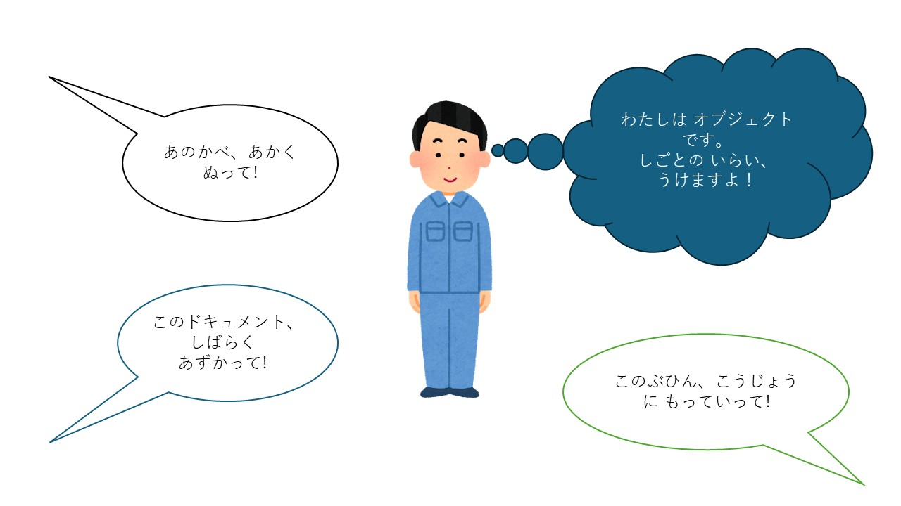
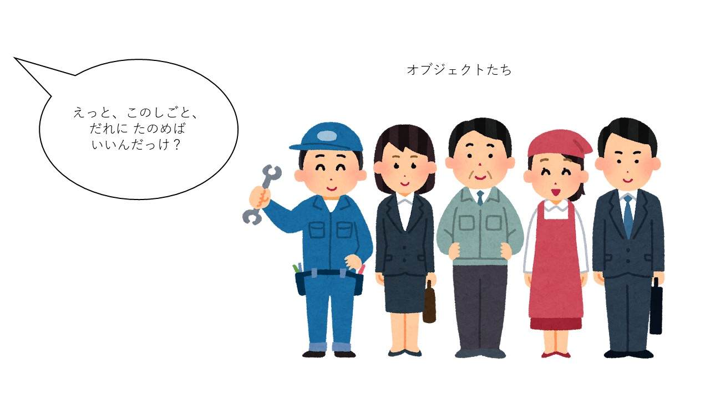
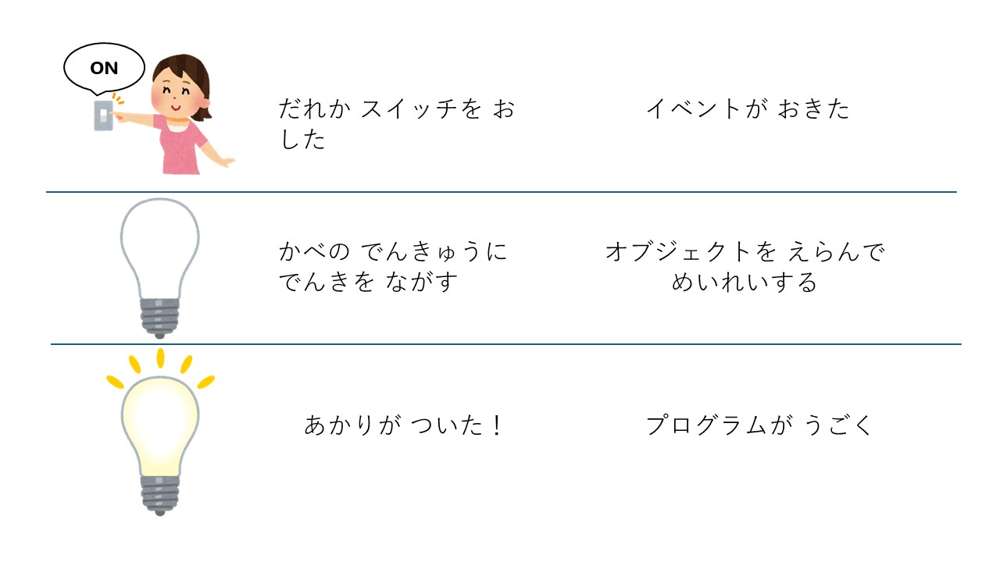

# JavaScriptを始める前に

**留学生のためのJavaScript学習ガイド：Webを動かす<ruby>魔法<rt>まほう</rt></ruby>を学ぼう**

<ruby>留学生<rt>りゅうがくせい</rt></ruby>のみなさん、こんにちは！プログラミングの世界へようこそ。

みなさんが毎日使っているスマートフォンやパソコンの<ruby>画面<rt>がめん</rt></ruby>。ボタンを押すとメニューが出てきたり、地図が動いたりしますね。これはすべて「JavaScript（ジャバスクリプト）」という言葉が<ruby>命令<rt>めいれい</rt></ruby>を出して動かしています。

このガイドでは、自分でウェブページを動かせるようになるための基礎（きそ）をやさしく解説します。それがJavaScriptの基本だからです。

> (参考)
> 現在のJavaScriptは、ウェブページの操作だけでなく、いろいろな用途に使えるプログラム言語になっています。しかし、今でも、ブラウザ上で活躍しています。

***

## I. 私たちの舞台：WWW（ワールド・ワイド・ウェブ）

まず、javaScriptの活躍の舞台、WWW（ワールド・ワイド・ウェブ）とは何かについて、説明しましょう。

**WWW（ワールド・ワイド・ウェブ）** は、世界中のコンピュータが「クモの巣（Web）」のようにつながって、情報を<ruby>共有<rt>きょうゆう</rt></ruby>する<ruby>仕組<rt>しく</rt></ruby>みのことです。

これを、**「図書館（としょかん）」** に<ruby>例<rt>たと</rt></ruby>えて、やさしく説明しますね。

### 1. 3つの大切な「道具」

WWWを動かすために、3つの<ruby>主役<rt>しゅやく</rt></ruby>がいます。

* **Webブラウザ（お客さん）**
ChromeやSafariなど、私たちがサイトを見るためのソフトです。「本を読みたい人」です。
* **Webサーバ（図書館のスタッフ）**
世界中のどこかにある、24時間動いているコンピュータです。「本を管理している人」です。
* **HTML（本の内容）**
ウェブサイトに書いてある文章や写真のデータです。これが「本」そのものです。

### 2. ウェブサイトが<ruby>表示<rt>ひょうじ</rt></ruby>されるまでの「4つのステップ」

あなたがブラウザでURLを<ruby>入力<rt>にゅうりょく</rt></ruby>してから、<ruby>画面<rt>がめん</rt></ruby>が出るまでの流れを見てみましょう。

1. **リクエスト（注文）：**
あなたが「このページを見たい！」とURLをクリックします。これは図書館のスタッフに「あの本を貸してください」と頼むのと同じです。
2. **住所の確認（DNS）：**
インターネットの世界では、`google.com`のような名前ではなく、数字の住所（IPアドレス <ruby>例<rt>たと</rt></ruby>えば、"142.251.223.46" みたいな）で場所を探します。
3. **レスポンス（返事）：**
サーバがあなたのリクエストを受けて、HTMLなどのデータをあなたのブラウザに送り返します。「はい、どうぞ！」と本を渡してくれるイメージです。
4. **レンダリング（<ruby>組<rt>く</rt></ruby>み<ruby>立<rt>た</rt></ruby>て）：**
ブラウザが、届いたHTMLデータを読み取って、きれいなデザインに<ruby>組<rt>く</rt></ruby>み<ruby>立<rt>た</rt></ruby>てて<ruby>表示<rt>ひょうじ</rt></ruby>します。

### 3. WWWで使われる「<ruby>魔法<rt>まほう</rt></ruby>の言葉」

ウェブの世界には、共通のルール（プロトコル）があります。

* **HTTP / HTTPS：**
情報をやり取りするときの「言葉のルール」です。
* **URL：**
ウェブサイトの「住所」です。世界に一つしかありません。

### まとめテーブル

| ITの言葉 | 図書館での<ruby>例<rt>たと</rt></ruby>え | 役割 |
| --- | --- | --- |
| **クライアント** | 本を読みたい人 | ブラウザでリクエストを送る |
| **サーバ** | 図書館のスタッフ | データを<ruby>保管<rt>ほかん</rt></ruby>して、<ruby>送<rt>おく</rt></ruby>り<ruby>返<rt>かえ</rt></ruby>す |
| **HTML** | 本のページ | 文字や写真のデータ |
| **URL** | 本の整理番号 | サイトがどこにあるか教える |

いかがでしょうか？「注文して、送ってもらって、<ruby>組<rt>く</rt></ruby>み<ruby>立<rt>た</rt></ruby>てる」。このシンプルな流れがWWWの<ruby>正体<rt>しょうたい</rt></ruby>です。

「WWWは、世界中の情報をだれでも、どこでも見られるようにしたすごい発明なんです。

***

## II. ウェブページを作る「3つの力」：HTML・CSS・JavaScriptの役割

ウェブページは、3つの技術がチームワークを発揮してできています。これを「家づくり」に<ruby>例<rt>たと</rt></ruby>えてみましょう。

|技術名|役割（やくわり）|家づくりに<ruby>例<rt>たと</rt></ruby>えると？|
|---|---|---|
|HTML|<ruby>骨組<rt>ほねぐ</rt></ruby>み・構造|柱、壁、床（ゆか）|
|CSS|<ruby>見<rt>み</rt></ruby>た<ruby>目<rt>め</rt></ruby>・デザイン|ペンキの色、インテリア、壁に貼る紙|
|JavaScript|<ruby>動<rt>うご</rt></ruby>き・機能（きのう）|電気（でんき）、機械装置（きかいそうち）|

### JavaScriptの役割：電気を通すこと

HTMLとCSSだけでは、家は完成しても「電気が通っていない」状態です。HTMLとCSSだけのウェブページは、ただ情報を<ruby>表示<rt>ひょうじ</rt></ruby>するだけの、<ruby>動<rt>うご</rt></ruby>きのない「紙のポスター」のようなものです。

JavaScriptという電気が通ることで、スイッチを押せばライトがつき、ドアの前に立てば自動ドアが開き、ボタンを押せばエレベーターが動くようになります。ウェブページはユーザーと「<ruby>対話<rt>たいわ</rt></ruby>（たいわ）」ができる便利な道具に変わるのです。

***

## III. イベントとは

### 1. 「きっかけ」を待っているコンピューター

<ruby>普段<rt>ふだん</rt></ruby>、ウェブページはただじっとしているだけに見えますが、実はあなたの操作を **「今か今かと待っている」** 状態です。

<ruby>例<rt>たと</rt></ruby>えば、あなたがこんな<ruby>動<rt>うご</rt></ruby>きをしたとき、それがすべて「イベント」になります。

* ボタンを **カチッ（クリック）** としたとき。
* キーボードで **文字を<ruby>入力<rt>にゅうりょく</rt></ruby>** したとき。
* <ruby>画面<rt>がめん</rt></ruby>を **上下に動かした（スクロール）** とき。

このように、**「ユーザーが何かをした！」** という出来事のことを、JavaScriptでは「イベント」と呼びます。

***

### 2. 「もし〜したら、〜する」という約束

イベントの考え方は、皆さんの日常（にちじょう）にある **「センサー」** と同じです。

* **自動ドア：** 「人が前に来たら（イベント）、ドアを開ける」
* **目覚まし時計：** 「朝の7時になったら（イベント）、音を鳴らす」
* **ウェブサイト：** 「ボタンが押されたら（イベント）、メッセージを出す」

JavaScriptを学ぶと、この **「もし〜が起きたら、この仕事をやってね！」** というマニュアルを書けるようになります。

***

### 3. 留学生への<ruby>導入<rt>どうにゅう</rt></ruby>メッセージ

> 「今はまだ、<ruby>難<rt>むずか</rt></ruby>しい<ruby>魔法<rt>まほう</rt></ruby>の言葉を覚える必要はありません。
> <ruby>画面<rt>がめん</rt></ruby>の中で起きる **『クリック』や『<ruby>入力<rt>にゅうりょく</rt></ruby>』などの変化の一つひとつに、名前（イベント）がついているんだな** 、ということだけ覚えておいてください。
> 皆さんが『何か』をしたときに、サイトが『<ruby>反応<rt>はんのう</rt></ruby>』するのは、このイベントのおかげなんですよ！」

***

### まとめ

| 言葉 | イメージ |
| --- | --- |
| **イベント** | 「何かが起きた！」という合図 |
| **きっかけ** | ユーザーがマウスやキーボードを動かすこと |
| **<ruby>反応<rt>はんのう</rt></ruby>** | <ruby>画面<rt>がめん</rt></ruby>の色が変わったり、窓が開いたりすること |

***

「ウェブページを生きているように動かすための『スイッチ』」。それがイベントです。

## IV. オブジェクトとは

皆さんがこれから学ぶのは、**ウェブページを動かす方法** です。ウェブページを動かすためには、**ウェブページを<ruby>表示<rt>ひょうじ</rt></ruby>しているブラウザに「これこれこういうことをしなさい」と命令する** ことが必要です。

### 1. オブジェクトとはどんなもの？

HTMLやCSSという設計図に従って、ブラウザはそれをウェブページとして作り上げてくれます。JavaScriptは出来上がったウェブページの部品を **「オブジェクト」** としてとらえ、それに対して『これこれこういうことをしなさい』と命令します。

さまざまな人が集まって会社ができているのと同じように、ウェブページももさまざまなオブジェクトから構成されています。そして、「会社に何かをしてもらう」というのは、実際には「その会社の人に何かをしてもらう」ことです。同じように、**「ウェブページを動かす」というのは「ウェブページのオブジェクトに何かをしてもらう」** ということです。

### 2. あいまいさのない命令：「誰が」「何をする」

JavaScripはマニュアルですから、「みんなで協力して、こういうことをやりなさい」とぼんやりした命令をするのではなく、「Aさんはこれをして」「Bさんはあれをして」と一人ひとりの作業を正確に伝えなければなりません。 **「誰が」「何をする」のかを、だれが読んでもわかるように書く** ことが大事です。

この「Aさん」「Bさん」がJavaScriptでは **「オブジェクト」** にあたります。

「オブジェクト」という言葉は、皆さんには聞きなれないものかもしれませんが、とりあえず、次のようなイメージを頭に思い描いてください。

* **ウェブページの中には、たくさんのオブジェクトと呼ばれるものがいて、JavaScriptを使って、彼らに命令すれば、仕事をしてくれるらしい**

今は、それだけで十分です。「オブジェクトの中身がどうなっているのか？」や「それに仕事をしてもらうためのマニュアルをどう書けばよいのか？」については、これから少しずつ、何度かに分けて説明します。

### 3. HTMLとCSS

では、JavaScriptで扱うオブジェクトとは具体的には、どんなものでしょうか？

ブラウザはサーバーからのレスポンスを受け取ります。そのレスポンスのうち「HTML」と「CSS」がウェブページという「家」の柱、壁、床（ゆか）、あるいはペンキ、インテリア、<ruby>壁紙<rt>かべがみ</rt></ruby>、といった部品になるのは、前に説明した通りです。

実は、この「ウェブページの部品」こそが、JavaScriptの **オブジェクト** です。

したがって、JavaScriptでウェブページを<ruby>操<rt>あやつ</rt></ruby>るためには、まずウェブページの部品そのものについて、理解しなければなりません。

次のステップでは、ウェブページの設計図である **HTML** と **CSS** について説明します。

***

## このセクションのまとめ

JavaScriptが動く順番をイラストで描くとこんな風になります。

つまり、JavaScriptでウェブページを動かすために

* 「何が起きたら」（どのイベントに反応させるか？）
* 「誰に」（どのオブジェクトに仕事をさせるか？）
* 「どういう仕事をさせるか？」（プログラムの内容）

を考えておく必要があります。「プログラムの内容」そのものだけではなく、その **プログラムをを動かすきっかけ（イベント）** と、**実際に動くもの（オブジェクト）** の関係が大事なのです。

***

それでは、まずウェブページの<ruby>骨組<rt>ほねぐ</rt></ruby>みである、「HTML」について、詳しく見てみましょう！