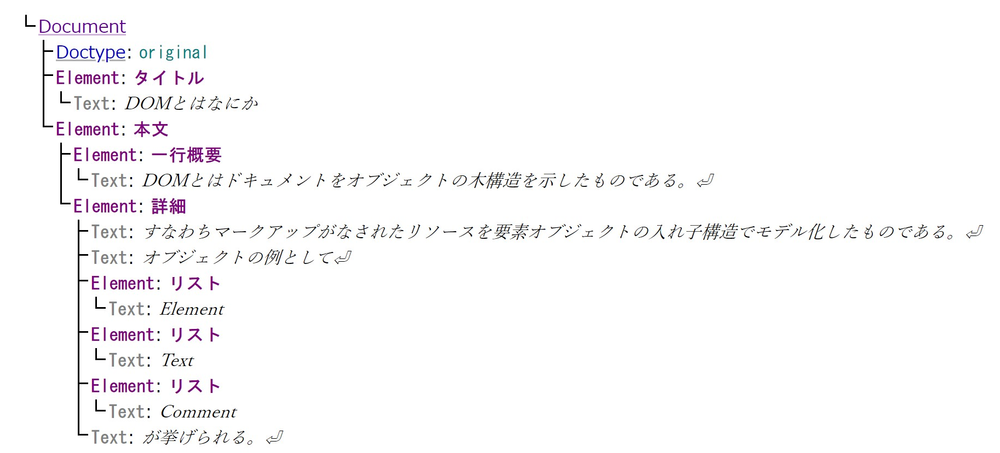

# DOMツリー

前のセクションで **DOM（ドム）ツリー** について、少しだけ触れました。しかし、その中には、「ブラウザに<ruby>表示<rt>ひょうじ</rt></ruby>されている**HTML（ウェブページの中身）** すべて」が含まれています。とてもたくさんの種類のオブジェクトが含まれます。


そのため、ここで新たなセクションを作って、もっと詳しく解説します。

***

## I. DOMとは？

### 1. DOMツリーってなに？

DOMは **D**ocument **O**bject **M**odel の<ruby>略<rt>りゃく</rt></ruby>です。
ブラウザはHTMLファイルを<ruby>読<rt>よ</rt></ruby>み<ruby>込<rt>こ</rt></ruby>むと、それをそのまま<ruby>表示<rt>ひょうじ</rt></ruby>するのではなく、まず扱いやすいように **「<ruby>枝分<rt>えだわ</rt></ruby>かれした木（Tree）」** の形に並べかえます。これがDOMツリーです。



DOM node tree" by Yuho.K is licensed under CC BY-SA 4.0.
This file is licensed under the Creative Commons [Attribution-Share Alike 4.0 International license](https://creativecommons.org/licenses/by-sa/4.0/deed.en).

### 2. ツリーの「<ruby>呼<rt>よ</rt></ruby>び<ruby>名<rt>な</rt></ruby>」と「関係」

DOMツリーを理解するコツは、**「家族（かぞく）」**の名前に<ruby>例<rt>たと</rt></ruby>えて覚えることです。

* **Document（ルート）：** 木の「<ruby>根<rt>ね</rt></ruby>っこ」です。一番上にあります。
* **Parent（親）：** ある要素の、すぐ上にある要素。
* **Child（子）：** ある要素の、すぐ中（下）にある要素。
* **Sibling（兄弟）：** 同じ親から生まれた、横に並んでいる要素。

> **<ruby>例<rt>れい</rt></ruby>：** `<ul>`（親）の中に、3つの `<li>`（子）があるとき、3つの `<li>` <ruby>同士<rt>どうし</rt></ruby>は「兄弟」になります。

### 3. なぜ「ツリー」にするの？

なぜわざわざ「木」の形にするのでしょうか？
それは、JavaScriptという「<ruby>魔法<rt>まほう</rt></ruby><ruby>使<rt>つか</rt></ruby>い」が、**特定のパーツをすぐに見つけやすくするため**です。

* 「一番上の親を赤くして！」
* 「2番目の兄弟を消して！」
* 「この子の隣（となり）に、新しい子を追加して！」

このように、ツリーの枝をたどるように命令ができるので、非常に便利なのです。

### 4. DOM操作（そうさ）のイメージ

留学生には、DOM操作を **「木になっているリンゴ（要素）を、もぎ取ったり、別の場所に植え替えたりする作業」** だと伝えてください。

1. **見つける（Select）：** `querySelector` などを使って、目的の枝まで行く。
2. **変える（Change）：** `style` や `textContent` で色や文字を変える。
3. **追加・削除（Update）：** `appendChild` で新しい枝を付けたり、`remove` で枝を切ったりする。

### 5. 留学生へのアドバイス

> 「HTMLファイルはただの『文字の集まり（テキスト）』だけど、ブラウザがそれを **DOMツリーという『生きている木』** に変えてくれるんだ。
> JavaScriptはこの木を自由に育てるための道具だよ。木の関係（親・子・兄弟）が分かれば、どんな複雑なページも自由に操（あやつ）れるようになるよ！」

### まとめテーブル

| 専門用語 | 意味 | 家族で<ruby>例<rt>たと</rt></ruby>えると？ |
| --- | --- | --- |
| **Document** | ツリー全体の入り口 | ご先祖（せんぞ）様 |
| **Element** | `<div>` や `<p>` などの要素 | 家族の一人ひとり |
| **Parent Node** | すぐ上の要素 | お父さん・お母さん |
| **Child Node** | すぐ下の要素 | 息子・娘 |
| **Sibling** | 同じ<ruby>階層<rt>かいそう</rt></ruby>にある要素 | 兄・妹 |

いかがでしょうか？「木の関係図」というイメージが持てれば、DOM操作はぐっと簡単になります。


## II. Formオブジェクト

ウェブサイトで自分の名前を<ruby>入力<rt>にゅうりょく</rt></ruby>したり、アンケートに答えたりするときに使うのが「フォーム（お問い合わせ、ログイン<ruby>画面<rt>がめん</rt></ruby>など）」です。

JavaScriptでは、これらを **Formオブジェクト** として扱います。留学生の方には、Formオブジェクトは**「役所の窓口（まどぐち）」**だと教えてあげてください。

***

### 1. Formオブジェクトとは？

HTMLの `<form>` タグで囲まれた部分のことです。ユーザーが<ruby>入力<rt>にゅうりょく</rt></ruby>したデータをまとめて管理し、サーバー（<ruby>裏側<rt>うらがわ</rt></ruby>のコンピュータ）へ送る準備をする役割（やくわり）を持っています。

JavaScriptでは、主に以下の2つの方法でフォームを捕まえ（アクセスし）ます。

1. **`document.forms[0]`** （ページにある1番目のフォーム）
2. **`document.getElementById("myForm")`** （ID名で指定）

***

### 2. よく使うプロパティ（フォームの情報）

窓口（フォーム）が持っている<ruby>設定<rt>せってい</rt></ruby>情報です。

* **`name`**
フォームの名前です。複数のフォームがあるときに区別するために<ruby>使<rt>つか</rt></ruby>います。
* **`action`**
データをどこ（どのURL）に送るかという「<ruby>宛先<rt>あてさき</rt></ruby>（あてさき）」です。
* **`method`**
データの送り方です。主に `GET`（URLにのせる）か `POST`（封筒に入れる）のどちらかです。
* **`elements`**
フォームの中にあるボタンや<ruby>入力<rt>にゅうりょく</rt></ruby>欄（<ruby>入力<rt>にゅうりょく</rt></ruby>パーツ）を、<ruby>配列<rt>はいれつ</rt></ruby>のような形でまとめて持っています。

***

### 3. よく使うメソッド（フォームを動かす）

* **`submit()`**
「<ruby>送信<rt>そうしん</rt></ruby>（そうしん）ボタン」を押さなくても、JavaScriptから<ruby>強制<rt>きょうせい</rt></ruby>的にデータを送ります。
* **`reset()`**
<ruby>入力<rt>にゅうりょく</rt></ruby>した内容をすべて消して、最初の状態（空っぽ）に戻します。

***

### 4. フォームの中の「<ruby>入力<rt>にゅうりょく</rt></ruby>パーツ」の操作

留学生が一番やりたいのは、**「ユーザーが書いた文字を読み取ること」**です。これは、各パーツの **`value`（バリュー）** プロパティを<ruby>使<rt>つか</rt></ruby>います。

```javascript
// 1. フォーム全体を取得（しゅとく）
const myForm = document.forms["loginForm"];

// 2. ユーザーが書いた「ユーザー名」を取り出す
const userName = myForm.elements["uName"].value;

// 3. 送信（そうしん）する前にチェックする
if (userName === "") {
  alert("名前を書いてください！");
} else {
  myForm.submit(); // 問題なければ送信（そうしん）！
}

```

***

### 5. 留学生への説明ポイント：`onsubmit` イベント

データを送る瞬間に「ちょっと待って！今の<ruby>入力<rt>にゅうりょく</rt></ruby>、間違っていない？」とチェックする機能がよく使われます。

> **「`onsubmit` は、窓口で書類（しょるい）を渡す前の『最終チェック』だよ。もし書き忘れがあったら `return false` と言って、<ruby>送信<rt>そうしん</rt></ruby>をストップさせるんだよ」**

```javascript
myForm.onsubmit = function() {
  if (this.elements["email"].value === "") {
    alert("メールアドレスが必要です！");
    return false; // 送信（そうしん）を中止（キャンセル）する
  }
  return true; // 送信（そうしん）する
};

```

***

### まとめテーブル

| プロパティ・メソッド | 役割 | <ruby>例<rt>たと</rt></ruby>え話 |
| --- | --- | --- |
| **`elements`** | 全パーツのリスト | 窓口にある書類の束（たば） |
| **`value`** | <ruby>入力<rt>にゅうりょく</rt></ruby>された文字 | 書類に書かれた内容 |
| **`submit()`** | <ruby>送信<rt>そうしん</rt></ruby>する | 書類を受け付けて送る |
| **`reset()`** | リセットする | 書類をゴミ箱に捨てて新しくする |

***

> [!TIP]
> **「id」と「name」の<ruby>使<rt>つか</rt></ruby>い<ruby>分<rt>わ</rt></ruby>け**
> 留学生には、**「JavaScriptでデザインを変えるときは `id`、サーバーにデータを送るときは `name` を使うのが一般的だよ」** と教えてあげると、混乱が少なくなります。

いかがでしょうか？「窓口」と「書類」のイメージで、フォームの操作もバッチリですね。

**次は、チェックボックスやラジオボタンなど、文字<ruby>入力<rt>にゅうりょく</rt></ruby>以外のパーツを操作する方法についても練習してみますか？**


## III. Elementオブジェクト

<ruby>前回<rt>ぜんかい</rt></ruby>の **`document`** が「現場監督（げんばかんとく）」なら、今回の **`Element` オブジェクト**は、現場にある**「レンガや窓、ドアといったひとつひとつの『部品（パーツ）』」**のことです。

HTMLタグ（`<div>`, `<h1>`, `<a>` など）が、JavaScriptの世界で「Elementオブジェクト」と呼ばれます。

***

### 1. Elementオブジェクトとは？

ウェブページを構成する「ひとつひとつの要素」です。
`document.getElementById()` などで見つけてきたものは、すべてこのElementオブジェクトになります。これを使うことで、特定のパーツだけの色を変えたり、文字を<ruby>書<rt>か</rt></ruby>き<ruby>換<rt>かえ</rt></ruby>えたりできます。

***

### 2. よく使うプロパティ（パーツの状態）

そのパーツがどんな状態（じょうたい）かを知るためのプロパティです。

#### **`id` / `className**`

HTMLの `id` や `class` の名前です。

* **注意：** JavaScriptでは `class` は予約語（特別な言葉）なので、プロパティ名は **`className`** と書きます。

#### **`innerHTML` / `textContent**`

パーツの中身（文字やタグ）です。

* **`textContent`**：中の「文字」だけを扱います。（安全でおすすめ！）
* **`innerHTML`**：中の「HTMLタグ」も含めて扱います。

#### **`style`**

<ruby>見<rt>み</rt></ruby>た<ruby>目<rt>め</rt></ruby>（CSS）を直接いじります。

* **<ruby>例<rt>れい</rt></ruby>：** `element.style.color = "blue";`

#### **`attributes`**

そのタグについている「<ruby>属性<rt>ぞくせい</rt></ruby>お<ruby>話<rt>はなし</rt></ruby>」のリストです。

***

### 3. よく使うメソッド（パーツへの操作）

パーツに対して「何かをする」ための命令です。

#### **<ruby>属性<rt>ぞくせい</rt></ruby>（じょうほう）を操作する**

* **`getAttribute("<ruby>属性<rt>ぞくせい</rt></ruby>名")`**：<ruby>設定<rt>せってい</rt></ruby>されている値（`src` や `href` など）を読み取ります。
* **`setAttribute("<ruby>属性<rt>ぞくせい</rt></ruby>名", "値")`**：新しく値をセットします。
* **`removeAttribute("<ruby>属性<rt>ぞくせい</rt></ruby>名")`**：<ruby>設定<rt>せってい</rt></ruby>を消します。

#### **クラスを操作する（とても便利！）**

* **`classList.add("クラス名")`**：クラスを追加する。
* **`classList.remove("クラス名")`**：クラスを消す。
* **`classList.toggle("クラス名")`**：あれば消す、なければ追加する。

#### **パーツを動かす**

* **`remove()`**：そのパーツを<ruby>画面<rt>がめん</rt></ruby>から消します。

***

### 4. 実際に動かしてみよう！

留学生に「<ruby>画像<rt>がぞう</rt></ruby>を<ruby>切<rt>きり</rt></ruby>り<ruby>替<rt>か</rt></ruby>えるボタン」の<ruby>仕組<rt>しく</rt></ruby>みを説明するコード<ruby>例<rt>れい</rt></ruby>です。

```javascript
// 1. タグ（Elementオブジェクト）を見つける
const myImage = document.querySelector("#profile-pic");

// 2. setAttribute で画像（がぞう）のURLを変える
myImage.setAttribute("src", "new-image.jpg");

// 3. classList でデザインを切（きり）り替（か）える
myImage.classList.add("rounded-frame");

```

***

### 5. 留学生へのアドバイス：`innerHTML` の注意点

留学生がよくやってしまう「危ない<ruby>書<rt>か</rt></ruby>き<ruby>方<rt>かた</rt></ruby>」について、一言教えてあげてください。

> 「`innerHTML` は便利だけど、ユーザーが<ruby>入力<rt>にゅうりょく</rt></ruby>した文字をそのまま入れると、悪いプログラム（ウイルスなど）が動かされる危険があるんだ。
> **ただの文字を<ruby>表示<rt>ひょうじ</rt></ruby>したいときは、必ず `textContent` を使おうね！**」

***

### まとめテーブル

| プロパティ・メソッド | 役割 | <ruby>例<rt>たと</rt></ruby>え話 |
| --- | --- | --- |
| **`id`** | ID名 | パーツの「名前ラベル」 |
| **`style`** | CSSデザイン | パーツの「服の色やサイズ」 |
| **`textContent`** | 中のテキスト | パーツに書いてある「看板の文字」 |
| **`setAttribute()`** | <ruby>設定<rt>せってい</rt></ruby>を変える | 窓を「開ける」か「閉める」か<ruby>設定<rt>せってい</rt></ruby>する |
| **`classList`** | クラスの管理 | パーツに「タグ（目印）」を貼ったり剥がしたりする |

***

いかがでしょうか？Elementオブジェクトを<ruby>使<rt>つか</rt></ruby>いこなせれば、ユーザーの<ruby>動<rt>うご</rt></ruby>きに合わせて<ruby>画面<rt>がめん</rt></ruby>を<ruby>動的<rt>どうてき</rt></ruby>に変える「動くサイト」が作れるようになります！


## IV. DOMツリーを使ったエレメントの<ruby>取得<rt>しゅとく</rt></ruby>

DOMツリーの「家族（<ruby>親子<rt>おやこ</rt></ruby>・兄弟）」の関係がわかったら、次は実際に**「その枝（え要素）をたどって、操作する方法」**を学びましょう！

留学生の方には、**「住所を知らなくても、<ruby>家系図<rt>かけいず</rt></ruby>をたどれば目的の人に会える」**というイメージで説明するとわかりやすくなります。

***

### 1. 要素の関係（プロパティ）を使ってたどる

IDやクラス名を使わなくても、今いる場所から「隣の人」や「親」を指名できます。

* **`parentNode`**（親）：
自分のすぐ上の要素。
* **`children`**（子）：
自分のなかにいる要素たちのリスト。
* **`previousElementSibling`**（前の兄弟）：
自分のすぐ上（前）にある同じレベルの要素。
* **`nextElementSibling`**（次の兄弟）：
自分のすぐ下（後）にある同じレベルの要素。

***

### 2. 実際にたどって操作するコード

<ruby>例<rt>たと</rt></ruby>えば、リスト（`<ul>`）の中の「2番目の項目」からスタートして、周りを操作してみましょう。

```javascript
// 1. まず、真ん中（まんなか）の「2番目」を捕まえる
const centerItem = document.getElementById("item2");

// 2. 「親」の背景（はいけい）色を変える（リスト全体がオレンジに！）
centerItem.parentNode.style.backgroundColor = "orange";

// 3. 「前の兄弟（1番目）」の文字を大きくする
centerItem.previousElementSibling.style.fontSize = "25px";

// 4. 「次の兄弟（3番目）」を消してしまう
centerItem.nextElementSibling.remove();

```

***

### 3. 要素を「追加」する（新しい枝を増やす）

DOMツリーに新しい要素を加えるときは、**「部品を作って、親に渡す」**という2ステップが必要です。

1. **`document.createElement("タグ名")`**：
新しい要素をメモリの中に作ります（まだ<ruby>画面<rt>がめん</rt></ruby>には出ません）。
2. **`親要素.appendChild(新しい要素)`**：
親の「最後の子」としてツリーに追加します。

```javascript
// ① 新しい <li> を作る
const newLi = document.createElement("li");
newLi.textContent = "新しい家族です！";

// ② <ul> を見つけて、その中に入れる
const list = document.querySelector("ul");
list.appendChild(newLi);

```

***

### 4. 留学生へのアドバイス：Elementを忘れないで！

ここでよくある間違いを教えてあげてください。

> 「`nextSibling`（兄弟）」と「`nextElementSibling`（**要素の**兄弟）」は似ているけど違うんだ。
> `nextSibling` は、目に見えない『<ruby>改行<rt>かいぎょう</rt></ruby>（かいぎょう）』や『スペース』も1つの枝として数えてしまうことがある。
> **「HTMLタグだけをたどりたいときは、名前に『Element』が入っている方を使おうね！」**

***

### まとめテーブル：たどるための<ruby>魔法<rt>まほう</rt></ruby>

| <ruby>魔法<rt>まほう</rt></ruby>の言葉 | 行き先 |
| --- | --- |
| **`parentElement`** | お父さん・お母さんのところへ |
| **`firstElementChild`** | 長男・長女のところへ |
| **`lastElementChild`** | 末っ子のところへ |
| **`nextElementSibling`** | 弟・妹のところへ |
| **`previousElementSibling`** | 兄・姉のところへ |

***

いかがでしょうか？「今いる場所」を基準にツリーを移動できるようになると、まるで迷路を攻略するように自由にHTMLを操作できるようになります。


## V. 要素の生成・追加・削除

DOMツリーの操作の中でも、**「新しく作る（生成）」「仲間に入れる（追加）」「さよならする（削除）」**の3つは、もっともワクワクする部分です。

留学生の方には、**「レゴブロックで新しいパーツを作って、<ruby>組<rt>く</rt></ruby>み<ruby>立<rt>た</rt></ruby>てたり外したりする遊び」**と同じだと教えてあげてください。

***

### 1. 要素を「作る（生成）」

まずは、<ruby>魔法<rt>まほう</rt></ruby>を使って何もないところにパーツを誕生させます。

* **`document.createElement("タグ名")`**
指定したタグ（`div`, `li`, `p` など）を新しく作ります。
> **注意：** この時点では、まだ「メモリの中」にあるだけで、**<ruby>画面<rt>がめん</rt></ruby>には見えません。**


```javascript
// 「たこ焼き（li）」というパーツを1つ作る
const takoyaki = document.createElement("li");

// 中身の文字を入れる
takoyaki.textContent = "たこ焼き 🐙";

```

***

### 2. 要素を「入れる（追加）」

作ったパーツを、DOMツリーのどこに置くかを決めます。

#### **`appendChild(新しい要素)`**

親要素の**「一番最後の子」**として追加します。一番よく<ruby>使<rt>つか</rt></ruby>います。

```javascript
const list = document.getElementById("food-list");
list.appendChild(takoyaki); // リストの最後にたこ焼きが登場！

```

#### **`insertBefore(新しい要素, 目印にする要素)`**

「一番最後じゃなくて、この要素の**前**に入れたい！」というときに<ruby>使<rt>つか</rt></ruby>います。

***

### 3. 要素を「消す（削除）」

いらなくなったパーツをツリーから<ruby>取<rt>と</rt></ruby>り<ruby>除<rt>のぞ</rt></ruby>きます。

#### **`要素.remove()`**

その要素を自分自身で<ruby>消去<rt>しょうきょ</rt></ruby>します。とても簡単です！

```javascript
const badApple = document.getElementById("rotten");
badApple.remove(); // 画面（がめん）から消える

```

#### **`親要素.removeChild(子要素)`**

昔からある方法で、「親が子を<ruby>取<rt>と</rt></ruby>り<ruby>除<rt>のぞ</rt></ruby>く」という<ruby>書<rt>か</rt></ruby>き<ruby>方<rt>かた</rt></ruby>です。

***

### 4. 実際に動かしてみよう！

留学生に「ToDoリストに項目を追加して、クリックしたら消える」という<ruby>魔法<rt>まほう</rt></ruby>のような<ruby>体験<rt>たいけん</rt></ruby>をさせてあげましょう。

```javascript
function addNote() {
  // 1. 生成：新しい <li> を作る
  const item = document.createElement("li");
  item.textContent = "勉強する 📖";

  // 2. 追加：リストの中に入れる
  const todoList = document.querySelector("#todo");
  todoList.appendChild(item);

  // 3. 削除の準備：クリックされたら消えるようにする
  item.onclick = function() {
    this.remove(); 
  };
}

```

***

### 5. 留学生へのアドバイス

> 「要素を作ったら、**『テキスト（textContent）』**や**『色（style）』**をセットして、最後に**『親（appendChild）』**に渡す。この **『作る → 飾る → 貼る』** の3ステップが基本だよ！」

***

### まとめテーブル

| 操作 | 使う<ruby>魔法<rt>まほう</rt></ruby>（メソッド） | イメージ |
| --- | --- | --- |
| **生成（作る）** | `createElement()` | レゴの新しいピースを用意する |
| **追加（最後へ）** | `appendChild()` | 列の最後尾に並ばせる |
| **追加（割り込み）** | `insertBefore()` | 「お先に失礼！」と間に入る |
| **削除（消す）** | `remove()` | 舞台（ぶたい）から退場する |

***

いかがでしょうか？「生成・追加・削除」ができるようになると、ユーザーがボタンを押すたびに<ruby>画面<rt>がめん</rt></ruby>がどんどん変わる、本格的なアプリが作れるようになります。


