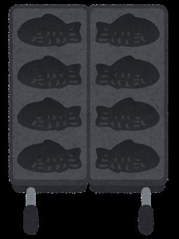
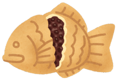

# クラスはオブジェクトの設計図

## I. クラスとコンストラクタ

「ユーザー<ruby>定義<rt>ていぎ</rt></ruby>オブジェクト」が作れるようになると、次にぶつかる壁が **「同じ形のオブジェクトを100人分作りたいときはどうするの？」** という問題です。

一人ずつ<ruby>手書<rt>てが</rt></ruby>きでオブジェクトを作るのは大変ですよね。そこで登場するのが **「クラス（Class）」** と **「コンストラクタ（Constructor）」** です。

これを **「たい<ruby>焼<rt>や</rt></ruby>きの型」** に<ruby>例<rt>たと</rt></ruby>えて説明します。


### 1. クラス（Class）とは？

クラスは、オブジェクトを作るための **「設計図（せっけいず）」** または **「型（かた）」** のことです。

* **クラス：** たい<ruby>焼<rt>や</rt></ruby>きの「型」。これ<ruby>自体<rt>じたい</rt></ruby>は食べられませんが、形を決めています。



* **オブジェクト（インスタンス）：** 型から焼かれた「たい<ruby>焼<rt>や</rt></ruby>き」。実際に食べられる実物です。



クラスを一度作っておけば、同じ特徴を持ったオブジェクトを何度でも、一瞬で作ることができます。

> [!note]
> 「インスタンス」という言葉は、「オブジェクト」とほぼ同じ意味ですが、より具体的なイメージです。<ruby>例<rt>たと</rt></ruby>えで言えば、「オブジェクト」が「たい<ruby>焼<rt>や</rt></ruby>き」全般を指すとすると、「インスタンス」は、今、あなた食べようとしている目の前の「たい<ruby>焼<rt>や</rt></ruby>き」という具体的な存在を指すイメージです。

[詳しくはこちら](./06_09_インスタンスとオブジェクト.html)

### 2. コンストラクタ（Constructor）とは？

コンストラクタは、クラスの中に書く **「<ruby>初期化<rt>しょきか</rt></ruby>（しょきか）のための<ruby>魔法<rt>まほう</rt></ruby>」** です。

たい<ruby>焼<rt>や</rt></ruby>きを焼くときに、「中身は何にする？」「あんこ？ クリーム？」と決める作業のことです。オブジェクトが誕生する瞬間に、名前や年齢などのデータをセットする役割を持っています。


### 3. コードで見てみよう！

クラスという「型」を使って、2人の学生を作ってみましょう。

```javascript
// 1. クラス（設計図）を作る
class Student {
  // 2. コンストラクタ（中身をセットする役割）
  constructor(name, age) {
    this.name = name; // この人の名前は〜
    this.age = age;   // この人の年齢は〜
  }

  // 3. メソッド（この型で作られた人ができる動（うご）き）
  sayHello() {
    console.log(`こんにちは、${this.name}です！`);
  }
}

// 4. クラスを使って実物（インスタンス）を作る
const studentA = new Student("アリ", 20);
const studentB = new Student("リン", 22);

studentA.sayHello(); // "こんにちは、アリです！"
studentB.sayHello(); // "こんにちは、リンです！"

```

> [!note]
> `this.name = name;`の右の`name`は<ruby>引数<rt>ひきすう</rt></ruby>として渡された`name`で、左の`this.name`は、`student`というクラスのインスタンスが<ruby>内部<rt>ないぶ</rt></ruby>に持つデータ、つまりオブジェクトのプロパティです。
> 
> `studentA.name` や `studentA[name]`で"アリ"を取り出すことができます。

### 4. <ruby>例<rt>たと</rt></ruby>え話：ハンコとスタンプ

> クラスは **『ハンコ』** です。
> ハンコの形（名前や年齢の枠）は決まっているよね。
> 実際に紙にポン！ と押して出てきた図形が **『オブジェクト（インスタンス）』**。
> 押すたびにインクの色（データ）を変えれば、同じ形だけど少し違うスタンプがたくさん作れるでしょ？
> **`new`** という言葉を使ってハンコを押すイメージなんですよ！


### 5. 大切なキーワードまとめ

| 言葉 | 意味 | <ruby>例<rt>たと</rt></ruby>え話 |
| --- | --- | --- |
| **Class（クラス）** | オブジェクトの設計図 | たい<ruby>焼<rt>や</rt></ruby>きの型 / ハンコ |
| **Constructor（コンストラクタ）** | 最初にデータをセットする場所 | 中身を詰める作業 |
| **Instance（インスタンス）** | クラスから作られた実物 | 焼けたたい<ruby>焼<rt>や</rt></ruby>き / 押されたスタンプ |
| **`new`** | 新しいインスタンスを作る命令 | 「焼いて！」という注文 |


### 📝 留学生へのアドバイス

> 最初は `this.name = name` のような<ruby>書<rt>か</rt></ruby>き<ruby>方<rt>かた</rt></ruby>にびっくりするかもしれないけど、これは **『新しく生まれる自分（this）のなまえを、もらった名前にセットしてね』** という意味なんです。
> 慣れてくると、100人でも1000人でも同じキャラクターを簡単に作れるようになるから、すごく便利ですよ！


いかがでしょうか？「型（クラス）」を作って、「注文（new）」して、「実物（インスタンス）」を作る。この流れが分かれば、<ruby>大規模<rt>だいきぼ</rt></ruby>なプログラムも怖くありません！

***


## II. <ruby>継承<rt>けいしょう</rt></ruby>：<ruby>効率<rt>こうりつ</rt></ruby>的に新しいものを作る

「クラス」という設計図の作り方がわかったら、次はもっと便利な **「<ruby>継承<rt>けいしょう</rt></ruby>（けいしょう / Inheritance）」** という<ruby>仕組<rt>しく</rt></ruby>みを覚えましょう！

<ruby>継承<rt>けいしょう</rt></ruby>とは、<ruby>例<rt>たと</rt></ruby>えて言えば、 **「親のいいところを<ruby>受<rt>う</rt></ruby>け<ruby>継<rt>つ</rt></ruby>いで、新しい独自の特徴をプラスすること」** です。


### 1. <ruby>継承<rt>けいしょう</rt></ruby>（Inheritance）とは？

「<ruby>継承<rt>けいしょう</rt></ruby>」とは、すでに作ってあるクラス（設計図）をベースにして、**新しいクラスを作ること** です。

たとえば、「動物（Animal）」というクラスがあれば、それを<ruby>継承<rt>けいしょう</rt></ruby>して「イヌ（Dog）」や「ネコ（Cat）」を作ることができます。

* 「動物」なら誰でも持っている特徴（名前、食べる<ruby>動<rt>うご</rt></ruby>き）は、**そのままもらう**。
* 「イヌ」だけの特徴（吠える<ruby>動<rt>うご</rt></ruby>き）は、**新しく書き足す**。

これが<ruby>継承<rt>けいしょう</rt></ruby>のすごいところです！


### 2. <ruby>書<rt>か</rt></ruby>き<ruby>方<rt>かた</rt></ruby>のキーワード：`extends` と `super`

JavaScriptで<ruby>継承<rt>けいしょう</rt></ruby>を使うときには、2つの大事な言葉を使います。

1. **`extends`（イクステンズ）：** 「〜を広げる（<ruby>継承<rt>けいしょう</rt></ruby>する）」という意味。
2. **`super`（スーパー）：** 「親（親クラス）」という意味。親のコンストラクタを呼び出すときに使います。

```javascript
// 1. 親クラス（ベース）：人間
class Person {
  constructor(name) {
    this.name = name;
  }
  sayHello() {
    console.log(`こんにちは、${this.name}です。`);
  }
}

// 2. 子クラス（継承（けいしょう））：留学生
// 「Person（人間）」をベースに「InternationalStudent」を作る
class InternationalStudent extends Person {
  constructor(name, country) {
    super(name); // 親クラスのコンストラクタに「名前」を渡す（重要！）
    this.country = country; // 新しい特徴（国籍）をプラス
  }

  // 3. 新しい動（うご）きをプラス
  introduce() {
    console.log(`${this.country}から来ました。よろしくお願いします！`);
  }
}

const user = new InternationalStudent("アハメド", "エジプト");
user.sayHello();  // 親からもらった動（うご）き
user.introduce(); // 自分だけの新しい動（うご）き

```


### 3. 留学生への<ruby>例<rt>たと</rt></ruby>え話：スマホの進化

> 最初の携帯電話（親クラス）は、『電話をする』『メールを送る』機能を持っていました。
> 次に登場したスマートフォン（子クラス）は、携帯電話の機能を **<ruby>継承<rt>けいしょう</rt></ruby>** しているから、もちろん電話もメールもできます。
> でも、そこに『アプリを入れる』とか『顔認証（かおにんしょう）』という **新しい機能を追加** したんだ。これが『<ruby>継承<rt>けいしょう</rt></ruby>』のイメージです！


### 4. なぜ<ruby>継承<rt>けいしょう</rt></ruby>を使うの？

留学生に、<ruby>継承<rt>けいしょう</rt></ruby>のメリットをこう伝えてあげてください。

* **楽ができる：** 同じことを何度も書かなくていいから、コードが短くなるよ。
* **間違いが減る：** 基本のルール（親）を直せば、全員（子）に反映されるから便利だよ。


### まとめテーブル

| 言葉 | 読み方 | 役割 |
| --- | --- | --- |
| **Parent Class** | 親クラス | 基本の設計図（ベース） |
| **Child Class** | 子クラス | <ruby>継承<rt>けいしょう</rt></ruby>して新しく作る設計図 |
| **`extends`** | イクステンズ | 「親から<ruby>受<rt>う</rt></ruby>け<ruby>継<rt>つ</rt></ruby>ぐよ！」という<ruby>宣言<rt>せんげん</rt></ruby> |
| **`super()`** | スーパー | 「親のコンストラクタを動かして！」という合図 |


> [!TIP]
> **「オーバーライド」もできます！**
> オブジェクトの「オーバーライド」と同様に、クラスでも、親からもらった<ruby>動<rt>うご</rt></ruby>きを、子クラスで<ruby>書<rt>か</rt></ruby>き<ruby>換<rt>かえ</rt></ruby>える「オーバーライド（<ruby>上書<rt>うわが</rt></ruby>き）」が使えます。「親のやり<ruby>方<rt>かた</rt></ruby>より、僕のやり<ruby>方<rt>かた</rt></ruby>のほうが得意だよ！」と<ruby>上書<rt>うわが</rt></ruby>きするイメージだと教えてあげると、より理解が深まります。

いかがでしょうか？「基本の形をもらって、自分流にアレンジする」。これが<ruby>継承<rt>けいしょう</rt></ruby>のパワーです！


## IV. まとめ：プログラマーのように考えよう

オブジェクト<ruby>指向<rt>しこう</rt></ruby>（しこう）は、単なる<ruby>書<rt>か</rt></ruby>き<ruby>方<rt>かた</rt></ruby>ではなく、**「複雑（ふくざつ）な現実（げんじつ）を整理（せいり）する方法」**です。

**アクションプラン**

[MDNの数<ruby>当<rt>あ</rt></ruby>てゲーム](https://developer.mozilla.org/ja/docs/Learn_web_development/Core/Scripting/A_first_splash)

上の「数<ruby>当<rt>あ</rt></ruby>てゲーム」を、オブジェクトを使って次のように改良（かいりょう）を考えてみてください。

* 「ゲーム全体」をひとつの大きなオブジェクトにする。
* プレイヤーの「これまでの<ruby>予想<rt>よそう</rt></ruby>履歴（よそうりれき）」をプロパティに保存する。
* 「当たり・ハズレの<ruby><rt>判定</rt>はんてい</ruby>」をメソッドにする。

<ruby>難<rt>むずか</rt></ruby>しい用語も、RPGや<ruby>自己<rt>じこ</rt></ruby>紹介カードのように<ruby>身近<rt>みじか</rt></ruby>なものに<ruby>例<rt>たと</rt></ruby>えれば、きっと理解（りかい）できるはずです。オブジェクトを使って、よりスマートでプロフェッショナルなプログラムを作っていきましょう。自信（じしん）を持って<ruby>挑戦<rt>ちょうせん</rt></ruby>（ちょうせん）してください！
