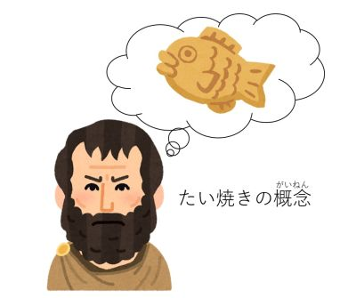

# インスタンスとオブジェクト

「オブジェクト」と「インスタンス」は、ベテランのエンジニアでも時々混ぜて使ってしまうほど似ている言葉です。

留学生の方には、 **「モノの種類（カテゴリー）」** か、 **「目の前にある実物（じつぶつ）」** か、という<ruby>視点<rt>してん</rt></ruby>の違いで説明してあげるとスッキリします。

***

### 1. 結論：二つの違いは「見ている角度」

* **オブジェクト (Object)：** 広い意味での「データのかたまり」という **<ruby>仕組<rt>しく</rt></ruby>み** のこと。
* **インスタンス (Instance)：** 設計図（クラス）から生まれた、**「具体的なひとつひとつの実物」** のこと。

***

### 2. 留学生への<ruby>例<rt>たと</rt></ruby>え話：タイ<ruby>焼<rt>や</rt></ruby>きと料理

この2つの<ruby>例<rt>たと</rt></ruby>えが<ruby>最強<rt>さいきょう</rt></ruby>に分かりやすいです。

#### **<ruby>例<rt>れい</rt></ruby>①：タイ<ruby>焼<rt>や</rt></ruby>き**

* **クラス：** タイ<ruby>焼<rt>や</rt></ruby>きの「型（かた）」です。

* **オブジェクト：** 「タイ<ruby>焼<rt>や</rt></ruby>き」という食べ物の<ruby>概念<rt>がいねん</rt></ruby>です。

* **インスタンス：** 今、あなたの手にある **「あんこが入った、温かいこの1つのタイ<ruby>焼<rt>や</rt></ruby>き」** のことです。

#### **<ruby>例<rt>れい</rt></ruby>②：料理のレシピ**

* **クラス：** カレーの「レシピ」です。
* **オブジェクト：** プログラミングの世界における「料理」というデータの形です。
* **インスタンス：** 今日の晩ごはんに作った **「お皿に乗っているカレー」** のことです。

***

### 3. 会話での<ruby>使<rt>つか</rt></ruby>い<ruby>分<rt>わ</rt></ruby>け（ここが重要！）

**「いつ、どっちの言葉を使うか」** を教えてあげましょう。

* **「オブジェクト」と言うとき：**
「JavaScriptは **オブジェクト** を使ってデータをまとめます」のように、プログラミングの **ルールや構造** について話すときに使います。
> **イメージ：** 「人間」という生き物。

* **「インスタンス」と言うとき：**
「`new Student()` で、アリさんの **インスタンス** を作りました」のように、**実際にメモリの中に作られた具体的なデータ** を指すときに使います。
> **イメージ：** 「アリさん」という特定の個人。

### 4. まとめテーブル

| 比較ポイント | オブジェクト | インスタンス |
| --- | --- | --- |
| **意味** | モノ、対象（たいしょう） | 具体的な実<ruby>例<rt>れい</rt></ruby>、実物 |
| **英語のニュアンス** | "A thing" (モノ) | "An example / One of them" (そのうちのひとつ) |
| **いつ使う？** | データの形を説明するとき | `new` で何かを作ったとき |
| **数** | 概念なので数えにくい | 「1つのインスタンス」と数えられる |

***

### 📝 留学生へのアドバイス

> 最初は全部 **『オブジェクト』** と呼んでいても間違いじゃありません。
> でも、**『設計図から生まれた、本物のデータ』** だということを<ruby>強調<rt>きょうちょう</rt></ruby>（きょうちょう）したいときに **『インスタンス』** という言葉を使うと、『お、この人はプログラミングを深く理解しているな！』と思ってもらえます！

***

いかがでしょうか？ 「実物（インスタンス）はオブジェクトの一種である」という関係性が伝われば<ruby>完璧<rt>かんぺき</rt></ruby>です。

<a href="javascript:history.back();">戻る</a>